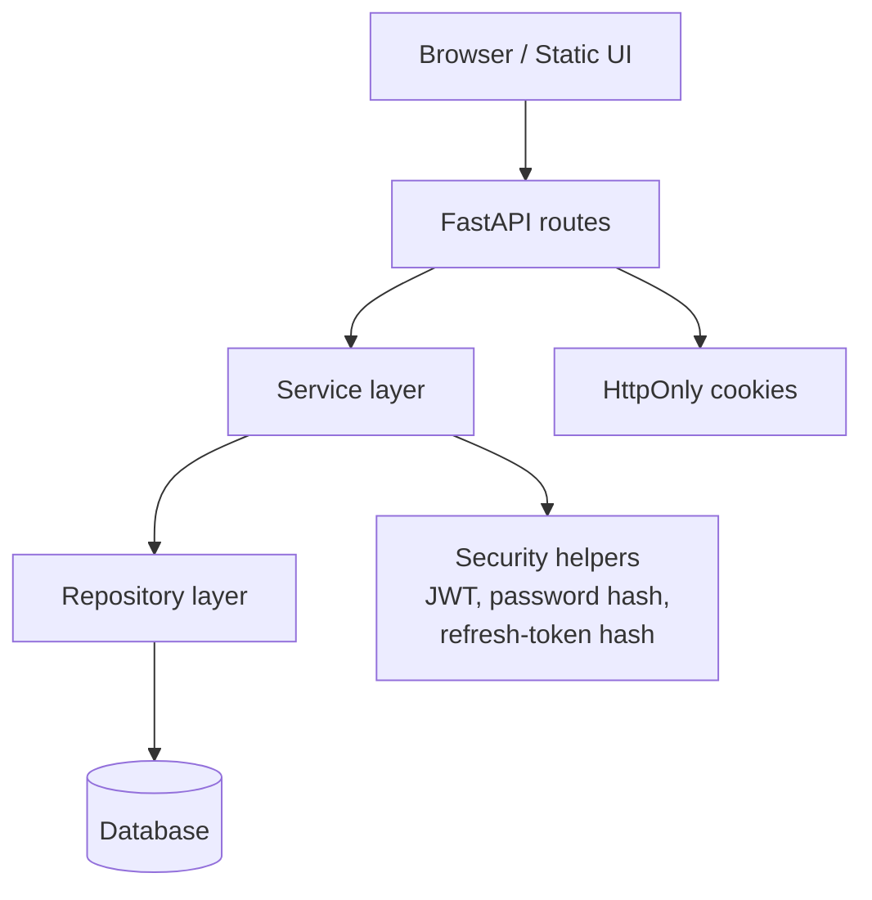
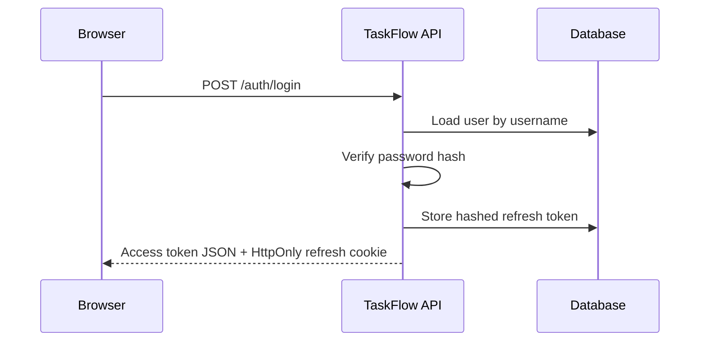
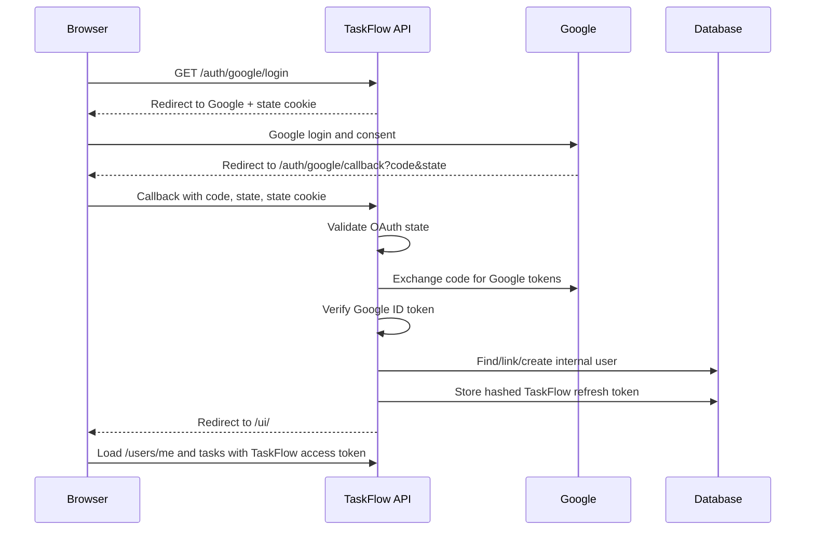

# TaskFlow

TaskFlow is a backend-focused FastAPI study project that implements a realistic task API with local authentication, refresh-token rotation, HttpOnly cookie refresh sessions, and Google OAuth login linked to the same internal user model.

The frontend is a small static UI mounted at `/ui`. Its purpose is to exercise the backend flows in a browser, not to be a full frontend framework project.

## Stack

- FastAPI
- SQLAlchemy async ORM
- Alembic
- PostgreSQL for development
- SQLite for tests through dependency override
- JWT access tokens
- Hashed opaque refresh tokens
- Google OAuth / OpenID Connect
- Static HTML/CSS/JS frontend mounted by FastAPI

## Features

- Local username/password registration and login
- Optional unique user email
- Bcrypt password hashing
- JWT access tokens
- Refresh tokens stored as SHA-256 hashes in the database
- Refresh-token rotation and reuse detection
- Logout and logout-all
- HttpOnly refresh-token cookie
- Google OAuth login with state validation
- Google ID token verification
- Provider account linking through `auth_accounts`
- Per-user task CRUD with ownership checks
- Per-user task ordering with position shifting after delete
- Search/filter/sort/pagination for tasks
- Global app-level error handling
- Static browser UI for auth and task workflows
- Test coverage for auth, users, tasks, OAuth, refresh rotation, logout, and cascade behavior

## Architecture



The code is split by responsibility:

- `app/api/routes`: HTTP routes, cookies, redirects, request/response contracts
- `app/services`: business rules and auth workflows
- `app/repos`: database queries and persistence helpers
- `app/models`: SQLAlchemy models
- `app/schemas`: Pydantic request/response/internal schemas
- `app/core`: settings, database, security, exceptions
- `frontend`: static browser UI
- `tests`: async API/service tests

## Auth Flow

Local login:



Google login:



Important distinction:

- Google proves the external identity through the verified ID token.
- TaskFlow still issues its own access token and refresh token for its own API.

## Running Locally

1. Create and activate a virtual environment.

2. Install dependencies:

```powershell
pip install -r requirements.txt
```

3. Create `.env` from `.env.example` and fill in required values.

4. Run migrations:

```powershell
alembic upgrade head
```

5. Start the API:

```powershell
uvicorn app.main:app --reload
```

6. Open the UI:

```text
http://localhost:8000/ui
```

## Google OAuth Setup

Create a Google OAuth client of type `Web application`.

Use this authorized redirect URI for local development:

```text
http://localhost:8000/auth/google/callback
```

Then set:

```env
GOOGLE_CLIENT_ID=...
GOOGLE_CLIENT_SECRET=...
GOOGLE_REDIRECT_URI=http://localhost:8000/auth/google/callback
```

If the Google consent screen is in testing mode, add your Google account as a test user.

## Tests

Run the full test suite:

```powershell
pytest -vv
```

The test database is SQLite and uses FastAPI dependency overrides. SQLite foreign keys are enabled in tests so cascade behavior is covered.

OAuth tests are split by layer:

- provider-neutral login/linking service
- Google OAuth provider service
- Google OAuth HTTP routes

## Security Notes

- Refresh tokens are opaque random values and are stored hashed in the database.
- Refresh tokens are sent as HttpOnly cookies.
- Refresh-token rotation revokes the old token and creates a new one.
- Refresh-token reuse detection revokes active tokens for that user.
- OAuth state is short-lived and single-use.
- Google account identity is linked by Google `sub`, not email.
- Verified email is used only as a safe first-time account-linking hint.
- For local HTTP development, refresh cookies do not use `Secure=True`.
- In production HTTPS, refresh cookies should use `Secure=True`.
- The frontend currently stores access tokens in localStorage as a learning tradeoff.
- Google client secrets must remain server-side and must not be committed.

## Finish Line

TaskFlow is considered complete as a study project when these flows are working and explainable:

- local register/login
- Google login and provider linking
- refresh-token rotation
- logout/logout-all
- task ownership enforcement
- user deletion cascade behavior
- tests passing
- `.env.example` and README available

Telegram auth, a framework frontend, teams, invitations, background jobs, and file uploads are intentionally left for a next project.
